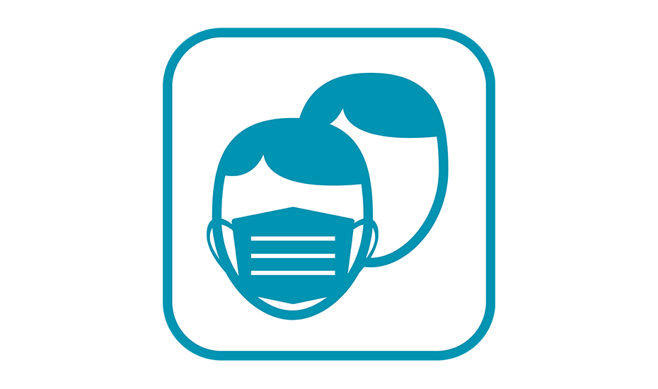
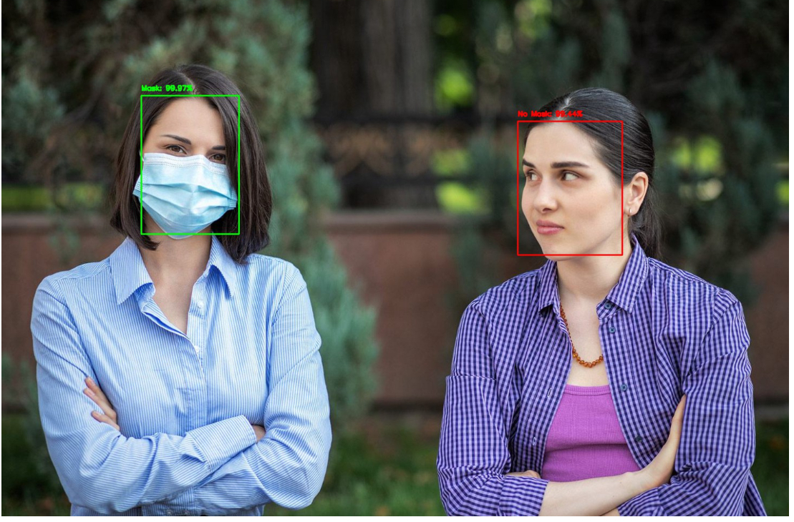

Centered Text

<h1 style="text-align: center;">Face Mask Detection</h1>

> Face Mask Detection web application built with opencv and tensorflow/     keras using Deeplearning model in order to detect mask over faces.
> It can be used in public places, airports, railway stations, offices, schools to curtail community spread of Corona virus.
> 

<h2 style="text-align: left;">Framwork used</h2>

 * **[Opencv](https://opencv.org)**
 * **[Tensorflow](https://www.tensorflow.org/)**
 * **[Keras](https://keras.io/)**
 * **[Caffe-based face detector](https://caffe.berkeleyvision.org/)**

<h2 style="text-align: left;">Dataset</h2>

The dataset used can be downloaded at [kaggle.com](https://www.kaggle.com/datasets/aneerbanchakraborty/face-mask-detection-data)

This dataset consists of 4095 images belonging to two classes:
* __With mask: 1915 images__
* __Without mask: 1918 images__

<h2 style="text-align: left;">Prerequisites</h2>

All the dependencies and required libraries are included in the file **requirements.txt**

<h2 style="text-align: left;">Installation</h2>

1. Clone the repository to your local machine
   >$ git clone https://github.com/elnazparsaei/face-mask-detection

2. Change your directory to the cloned repo
   >$ cd face-mask-detection
3. Install the required packages
   >$ pip install -r requirements.txt

<h2 style="text-align: left;">Running the project</h2> 

1. Run the app.py file
2. Open cmd in cloned project directory
   
3. To detect face masks in an image type, the following command:
    >$ streamlit run app.py  

<h2 style="text-align: left;">Contact</h2>

If you have any question or issues, feel free to mail me: [elnazparsaei1994@gmail.com](elnazparsaei1994@gmail.com)
